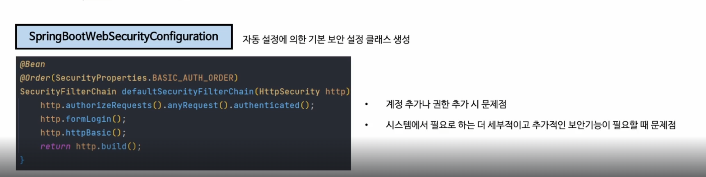

+ ## Spring Security
+ ### 자동설정의 의한 기본 보안 작동
  + 서버가 기동되면 Spring security의 초기화 작업 및 보안 설정이 이루어진다. 
  + <U>**별도의 설정이나 코드를 작성하지 않아도 기본적인 웹 보안 기능이 현재 시스템에 연동되어 작동한다.**</U>
    1. 기본적으로 모든 요청에 대하여 인증여부를 검증하고 인증이 승인되어야 자원에 접근이 가능하다.
    2. 인증 방식은 폼 로그인 방식과 httpBasic 로그인 방식을 제공한다.
    3. 인증을 시도할 수 있는 로그인 페이지가 자동적으로 생성되어 렌더링 된다.
    4. 인증 승인이 이루어질 수 있도록 한개의 계정이 기본적으로 제공된다.
       + SecurityProperties 설정 클래스에서 생성
       + username : user
       + password : 랜덤 문자열
    
  + 