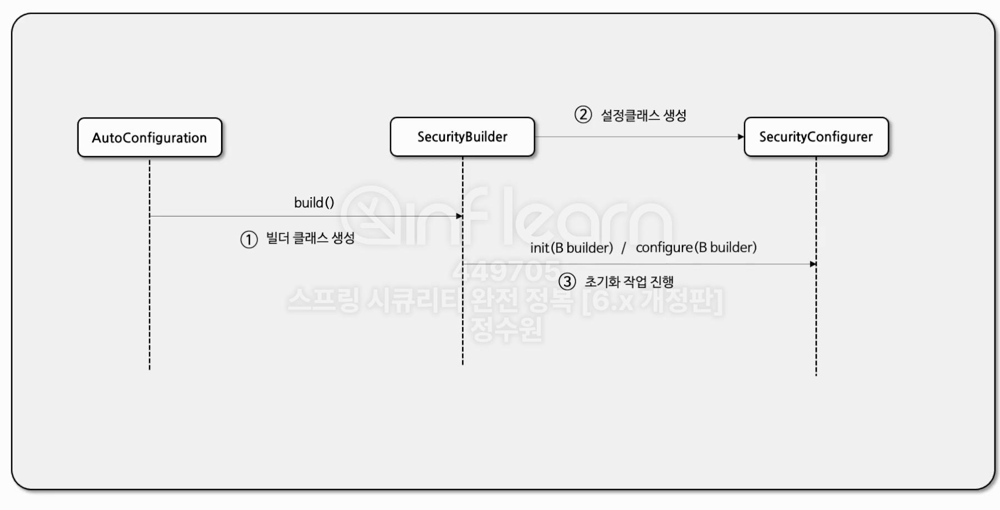

+ ## Spring Security

+ ### 자동설정의 의한 기본 보안 작동
  + 서버가 기동되면 Spring security의 초기화 작업 및 보안 설정이 이루어진다. 
  + <U>**별도의 설정이나 코드를 작성하지 않아도 기본적인 웹 보안 기능이 현재 시스템에 연동되어 작동한다.**</U>
    1. 기본적으로 모든 요청에 대하여 인증여부를 검증하고 인증이 승인되어야 자원에 접근이 가능하다.
    2. 인증 방식은 폼 로그인 방식과 httpBasic 로그인 방식을 제공한다.
    3. 인증을 시도할 수 있는 로그인 페이지가 자동적으로 생성되어 렌더링 된다.
    4. 인증, 인가 기본적인 검증은 Filter를 통해서 처리한다.
    5. 인증 승인이 이루어질 수 있도록 한개의 계정이 기본적으로 제공된다.
       + SecurityProperties 설정 클래스에서 생성
       + username : user
       + password : 랜덤 문자열
       

+ ### Security Builder
  + Builder 클래스로서 웹 보안을 구성하는 Bean 객체와 설정 클래스들을 생성하는 역활을 하며 
    대표적으로 <U>**Websecurity**</U>, <U>**HttpSecurity**</U>가 있다.
  + SecurityConfigurer를 참조하고 있으며 인증 및 인가 초기화 작업은 SecurityConfigurer에 의해 진행된다.
  
+ ### Security Configurer 
  + Http 요청과 관련된 보안처리를 담당하는 Filter들을 생성하고 여러 초기화 설정에 관여한다.

+ ### 초기화 순서
  + 1. AutoConfiguration이 자동 식별을 한다.
  + 2. build() 메소드를 통해 빌더클래스를 생성한다.
  + 3. SecurityBuilder가 SecurityConfigurer를 통해 설정클래스를 생성한다.
  + 4. SecurityConfigurer의 init(B builder), configure(B builder) 메소드를 통해 초기화 작업 진행 (매개변수로 SecurityBuilder를 받는다.)

