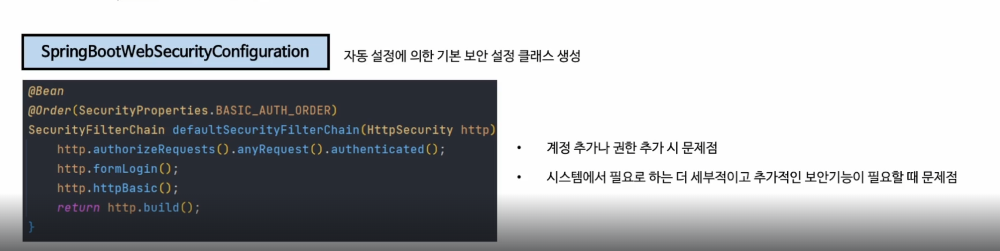
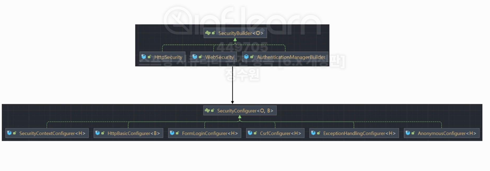
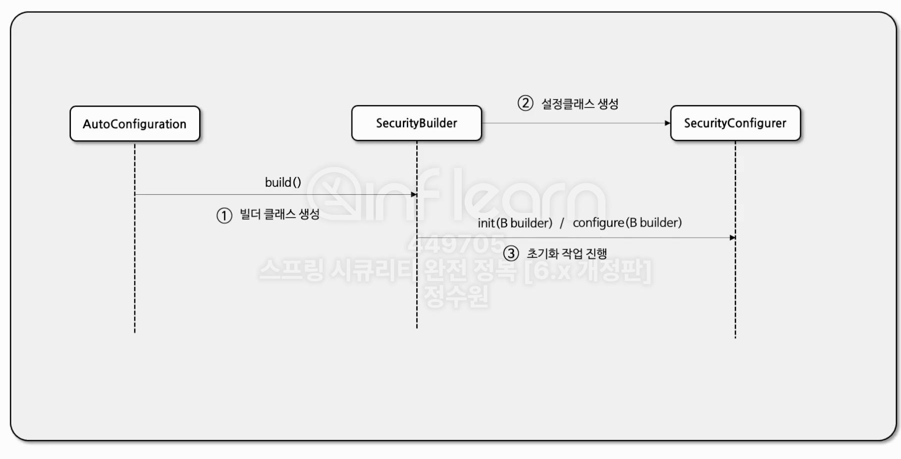
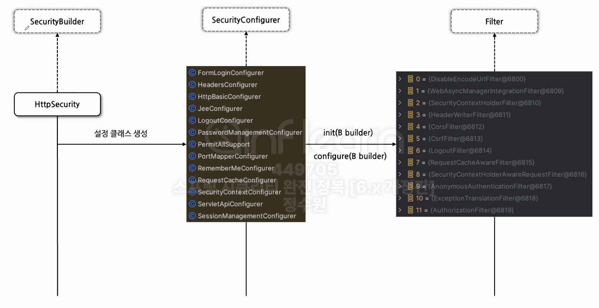
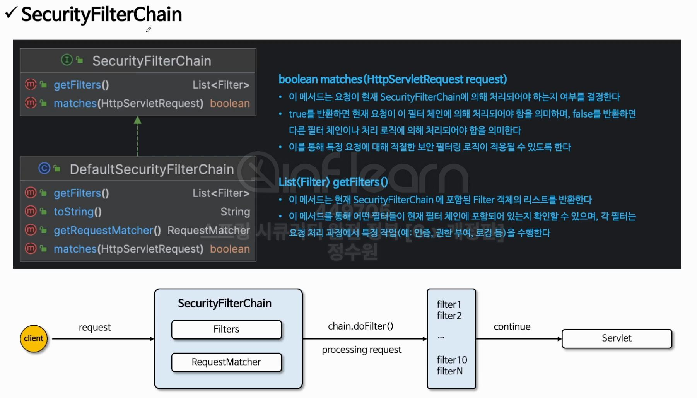
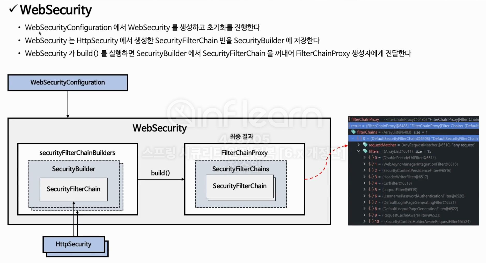
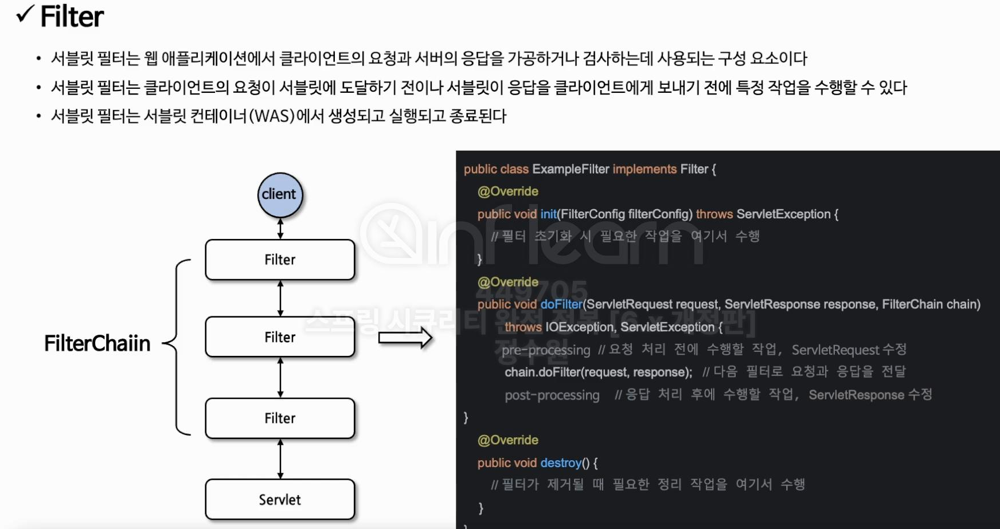
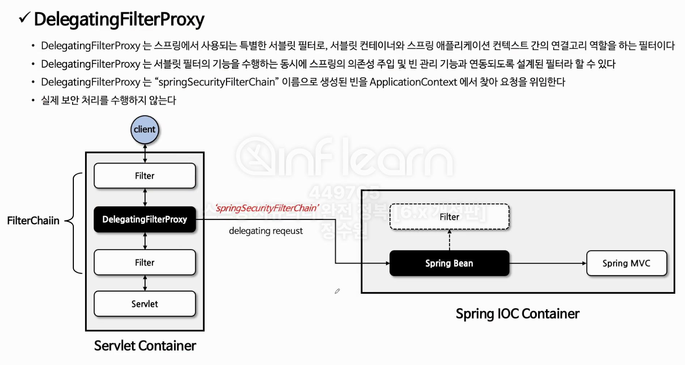
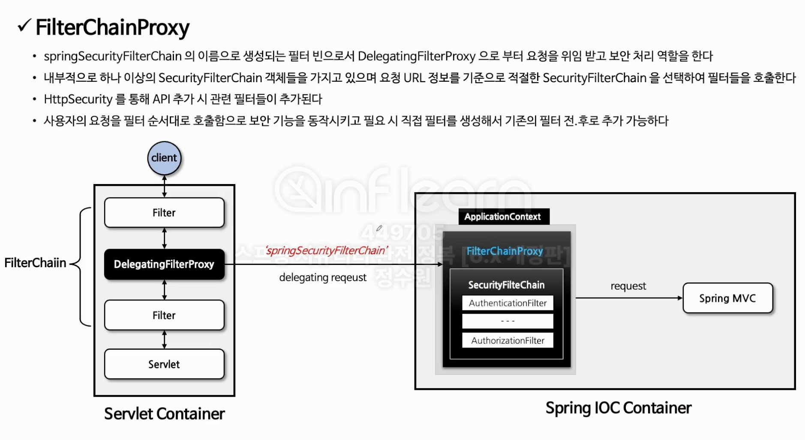
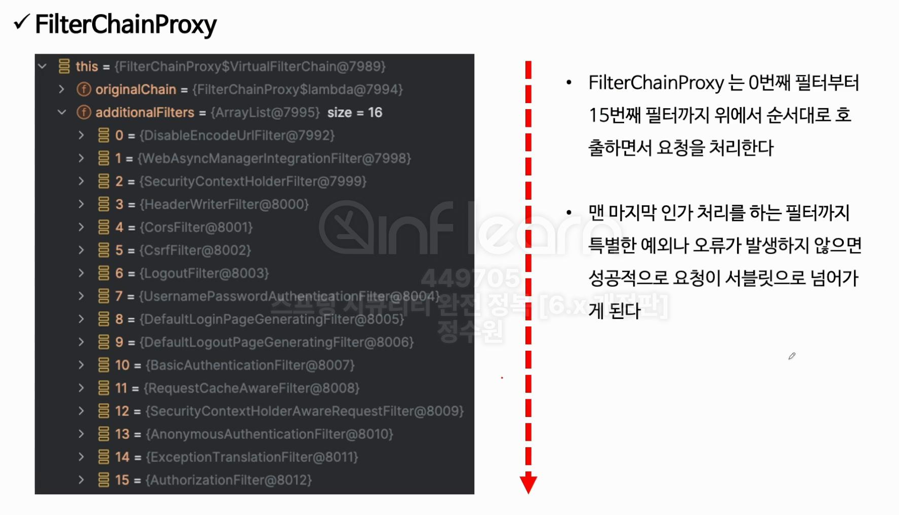

+ ## Spring Security
  + Spring Security는 모두 Filter 기반으로 움직인다.

+ ### 자동설정의 의한 기본 보안 작동
  + 서버가 기동되면 Spring security의 초기화 작업 및 보안 설정이 이루어진다. 
  + <U>**별도의 설정이나 코드를 작성하지 않아도 기본적인 웹 보안 기능이 현재 시스템에 연동되어 작동한다.**</U>
    1. 기본적으로 모든 요청에 대하여 인증여부를 검증하고 인증이 승인되어야 자원에 접근이 가능하다.
    2. 인증 방식은 폼 로그인 방식과 httpBasic 로그인 방식을 제공한다.
    3. 인증을 시도할 수 있는 로그인 페이지가 자동적으로 생성되어 렌더링 된다.
    4. 인증, 인가 기본적인 검증은 Filter를 통해서 처리한다.
    5. 인증 승인이 이루어질 수 있도록 한개의 계정이 기본적으로 제공된다.
       + SecurityProperties 설정 클래스에서 생성
       + username : user
       + password : 랜덤 문자열
       

+ ### Security Builder
  + Builder 클래스로서 웹 보안을 구성하는 Bean 객체와 설정 클래스들을 생성하는 역활을 하며 
    대표적으로 <U>**Websecurity**</U>, <U>**HttpSecurity**</U>가 있다.
  + SecurityConfigurer를 참조하고 있으며 인증 및 인가 초기화 작업은 SecurityConfigurer에 의해 진행된다.
  
+ ### Security Configurer 
  + Http 요청과 관련된 보안처리를 담당하는 Filter들을 생성하고 여러 초기화 설정에 관여한다.

+ ### 초기화 순서
  + 1. AutoConfiguration이 자동 식별을 한다.
  + 2. build() 메소드를 통해 빌더클래스를 생성한다.
  + 3. SecurityBuilder가 SecurityConfigurer를 통해 설정클래스를 생성한다.
  + 4. SecurityConfigurer의 init(B builder), configure(B builder) 메소드를 통해 초기화 작업 진행 (매개변수로 SecurityBuilder를 받는다.)

+ ### Security FilterChain
  + 메서드 종류
    + > boolean matches(HttpServletRequest request)
      + 이 메서드는 <U>**요청이 현재 SecurityFilterChain에 의해 처리되어야 하는지 여부를 결정**</U>한다.
      + true를 반환하면 현재 요청이 이 필터체인에 의해 처리되어야 함을 의미하며, false를 반환하면
        다른 필터 체인이나 처리 로직에 의해 처리되어야 함을 의미한다.
      + 이를 통해 특정 요청에 대해 적절한 보안 필터링 로직이 적용될 수 있도록 한다.
    + > List<Filter> getFilters()
      + 이 메서드는 현재 <U>**SecurityFilterChain에 포함된 Filter 객체의 리스트를 반환**</U>한다.
      + 이 메서드를 통해 어떤 필터들이 현재 필터 체인에 포함되어 있는지 확인할 수 있으며, 각 필터는
        요청 처리 과정에서 특정 작업 (ex: 인증, 권한부여, 로깅 등)을 수행한다.
  + 최종 목표 :
    + HttpSecurity로 Security FilterChain을 만들 수 있다.

+ ### WebSecurity
  + WebSecurityConfiguration 에서 WebSecurity를 생성하고 초기화를 진행한다.
  + WebSecurity 는 HttpSecurity 에서 생성한 SecurityFilterChain Bean을 SecurityBuilder에 저장한다.
  + WebSecurity 가 build()를 실행하면 <U>**SecurityBuilder**</U> 에서 <U>**SecurityFilterChain**</U> 을 꺼내어 <U>**FilterChaiProxy**</U> 생성자에게 전달한다.
  + 최종 목표 :
    + WebSecurity로 FilterChainProxy를 만들 수 있다.

+ ### Filter
  + 서블릿 필터는 웹 애플리케이션에서 클라이언트의 요청과 서버의 응답을 가공하거나 검사하는데 사용되는 구성 요소이다.
  + 서블릿 필터는 클라이언트의 요청이 서블릿에 도달하기 전이나 서블릿이 응답을 클라이언트에게 보내기 전에 특정 작업을 수행할 수 있다.
  + 서플릿 필터는 서블릿 컨테이너(WAS)에서 생성되고 실행되고 종료된다. 

+ ### DelegatingFilterProxy
  + DelegatingFilterProxy는 서블릿 컨테이너(WAS)에서 생성한다.
  + DelegatingFilterProxy는 모든 Request에 대해 거치는 단계이다.
  + 기본적으로 Spring은 Filter에서 AOP나 DI를 사용을 하지 못한다.
    하지만 DelegatingFilterProxy를 통해 Spring에서도 Filter라는 타입의 클래스들을 Bean으로 생성해서
    Filter가 AOP나 DI를 같은 Spring의 기능들을 가지고서 처리를 할 수 있다.
  + DelegatingFilterProxy는 Spring에서 사용되는 특별한 서블릿 필터로, 서블릿 컨테이너와 Spring 애플리케이션 컨텍스트간의 연결고리 역활을 하는 필터이다.
  + DelegatingFilterProxy는 서블릿 필터의 기능을 수행하는 동시에 스프링의 의존성 주입 및 빈 관리 기능과 연동되도록 설계뙨 필터라 할 수 있다.
  + DelegatingFilterProxy는 <U>**springSecurityFilterChain**</U> 이름으로 생성된 Bean을 ApplicationContext 에서 찾아 요청을 위임한다.
  + 실제 보안처리를 하지 않는다.

+ ### FilterChainProxy
  + <U>**springSecurityFilterChain**</U> 의 이름으로 생성되는 Filter Bean으로서 DelegatingFilterProxy으로부터 요청을 위임 받고 보안 처리 역활을 한다.
  + 내부적으로 하나 이상의 SecurityFilterChain 객체들을 가지고 있으며 요청 URL 정보를 기준으로 적절한 SecurityFilterChain 을 선택하여 필터들을 호출한다.
  + HttpSecurity 를 통해 API 추가시 관련 필터들이 추가된다.
  + 사용자의 요청을 Filter 순서대로 호출함으로 보안 기능을 동작시키고 필요 시 직접 필터를 생성해서 기존의 Filter 전, 후로 추가 가능하다.

